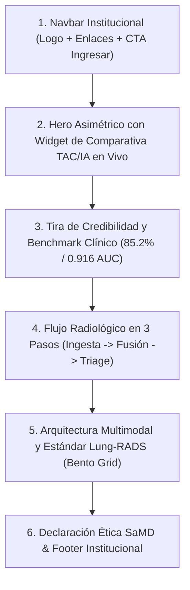

# OncoScan Frontend Design System & Anti-Vibecoding Guide

> **Propósito:** Guía definitiva y canónica para el diseño y desarrollo de interfaces en OncoScan. Elimina la estética genérica de "plantilla vibecodeada de IA" e implementa una dirección visual de **Precisión Clínica & Deep Tech**, alineada con los más altos estándares de software médico internacional (*Linear meets Aidoc / Lunit / Epic Systems*).

---

## 0. Identidad y Misión de OncoScan

- **Qué es OncoScan:** Plataforma de inteligencia artificial multimodal para la detección temprana, triage y explicabilidad radiológica (Grad-CAM) de nódulos pulmonares sospechosos en tomografías de tórax (TAC / DICOM), integrando 8 variables clínicas del estándar Lung-RADS.
- **Audiencia Objetivo:** Médicos radiólogos, neumólogos, oncólogos, residentes clínicos y directores de centros hospitalarios en entornos con escasez de especialistas.
- **Tono Visual:**
  - **Autoridad médica:** Sobrio, confiable, limpio, de nivel hospitalario.
  - **Precisión técnica:** Retículas nítidas, tipografía técnica, datos contrastados, bordes de 1px.
  - **Cero "AI Slop":** Sin esferas brillantes moradas de fondo, sin tarjetas vacías con íconos decorativos genéricos, sin efectos de cristal exagerados que resten legibilidad.

---

## 1. Sistema Canónico de Color (Tokens Oficiales)

Para evitar discrepancias en todo el código, estos son los **únicos** colores aprobados:

| Token Tailwind / CSS | Hex | Rol y Uso Clínico |
| :--- | :--- | :--- |
| `brand-primary` | `#012641` | **Azul Naval Profundo (Deep Space Navy).** Color institucional principal. Usado en Navbar, Sidebar, títulos de alta jerarquía, y botones primarios de navegación. |
| `brand-primary-hover` | `#01365e` | Estado hover de botones y enlaces basados en primary. |
| `brand-danger` | `#D4004F` | **Frambuesa Quirúrgica (Cerise / Deep Raspberry).** Color de acento de marca y llamada a la acción principal (CTA primario, botones de análisis, indicador de ALTO riesgo, acentos destacados). |
| `brand-danger-hover` | `#c4004a` | Estado hover para el botón primario frambuesa. |
| `brand-bg` | `#F8F9FA` | Fondo base de plataforma (blanco clínico suavizado, previene fatiga ocular del especialista). |
| `brand-surface` | `#FFFFFF` | Fondo de tarjetas clínicas, modales, visores y contenedores. |

### Paleta Semántica de Riesgo Oncológico

Los niveles de riesgo deben ser unívocos y accesibles (WCAG AA):

| Nivel de Riesgo | Clases Tailwind | Hex Base | Uso |
| :--- | :--- | :--- | :--- |
| **BAJO** | `bg-emerald-50 text-emerald-700 border-emerald-200` | `#15803D` | Score $< 0.33$. Nódulo benigno / control anual. |
| **MEDIO** | `bg-amber-50 text-amber-700 border-amber-200` | `#B45309` | Score $0.33 - 0.66$. Sospecha intermedia / TAC en 3-6 meses. |
| **ALTO** | `bg-rose-50 text-rose-700 border-rose-200` | `#D4004F` | Score $> 0.66$. Alta sospecha oncológica / biopsia o PET-CT. |

### Escala de Textos y Contrastes Neutros

- **Headings & Títulos de impacto:** `text-slate-900` (`#0F172A`) o `text-brand-primary` (`#012641`).
- **Cuerpo de lectura clínica:** `text-slate-700` (`#334155`).
- **Metadatos, etiquetas secundarias:** `text-slate-500` (`#64748B`).
- **Bordes y separadores:** `border-slate-200` (`#E2E8F0`) o `border-slate-100` (`#F1F5F9`).

---

## 2. Tipografía e Iconografía

### Tipografía
- **Fuente Sans:** `var(--font-inter)` / `Inter` o `Geist`.
  - Display / H1: `tracking-tight font-bold`.
  - Body: `text-sm` o `text-base` con `leading-relaxed`.
- **Fuente Mono:** `var(--font-geist-mono)`.
  - Usada para: UIDs DICOM, tags médicos, valores numéricos de score (e.g. `85.2%`), matrices de confusión y métricas de modelo.

### Iconografía
- **Librería oficial:** `lucide-react`.
- **Regla de estilo:** `strokeWidth={1.5}` o `strokeWidth={1.75}` constante en toda la página. No mezclar íconos rellenos gruesos con trazos ultrafinos.
- **Prohibido:** No usar emojis decorativos en títulos institucionales. Usar íconos médicos precisos (`Activity`, `Stethoscope`, `Layers`, `Scan`, `ShieldCheck`).

---

## 3. Disciplina Anti-Vibecoding (Patrones Prohibidos vs Aprobados)

### ❌ Lo que hace que una web parezca "vibecodeada" (PROHIBIDO)
1. **El Hero con fondo negro y esfera borrosa morada/azul:**  
   `w-[600px] h-[600px] bg-brand-danger/20 blur-[120px] rounded-full`.  
   Es el cliché #1 de las IAs generadoras de plantillas en 2024–2026. Transmite que el proyecto es una maqueta rápida y no un sistema clínico serio.
2. **Las "3 tarjetas idénticas con ícono arriba":**  
   Tres cajas cuadradas una al lado de la otra con un ícono dentro de un círculo de color pastel y 2 líneas de texto vago.
3. **Capturas de pantalla falsas hechas con divs:**  
   Rectángulos grises que simulan dashboards ficticios con barras horizontales.
4. **Titulares kilométricos de 4 líneas:**  
   Un H1 que ocupa toda la pantalla con palabras de relleno como "Revolucionando el futuro holístico de la salud".
5. **Glassmorphism sobrecargado:**  
   Fondos transparentes con desenfoque que vuelven ilegibles los textos médicos cuando hay luz ambiental.

### ✅ La estética OncoScan (Clinical Precision & Deep Tech)
1. **Luz y claridad institucional:**  
   Fondos claros y luminosos (`#FFFFFF` y `#F8F9FA`) con secciones de contraste deliberado en `#012641` para momentos clave (e.g. demostración técnica o CTA final).
2. **Componentes interactivos reales en la landing:**  
   En lugar de una captura estática, un **Widget Interactivo de Prueba** donde el visitante pueda mover el slider de cortina o presionar el botón de **Parpadeo** sobre una tomografía real de muestra.
3. **Métricas científicas verificadas:**  
   Resaltar los resultados matemáticos reales del modelo:
   - **85.2%** Exactitud global
   - **0.916** AUC-ROC
   - **738** Tomografías de validación clínica
   - **8** Variables clínicas Lung-RADS
4. **Retículas Bento asimétricas:**  
   Composiciones con ritmo: una celda ancha para el visor, dos celdas medianas para la arquitectura y features clínicas.
5. **Micro-interacciones táctiles:**  
   Estados hover claros, transiciones suaves (`duration-200`), y retroalimentación táctil en botones (`active:scale-[0.98]`).

---

## 4. Blueprint para el Rediseño de la Landing Page (`apps/web/src/app/page.tsx`)

La landing page debe estructurarse en **6 secciones con propósito quirúrgico**:

### Detalle de Secciones:

### 1. Navbar Institucional
- Altura fija `h-16 md:h-20`, fondo `bg-white/95 backdrop-blur-md`, borde inferior sutil `border-b border-slate-200/80`.
- Logo nítido a la izquierda (`logo-oncascan.png`).
- Enlaces de anclaje claros: *Explicabilidad*, *Validación Clínica*, *Arquitectura*, *Documentación*.
- Botón derecho: *"Ingresar al Sistema"* con `bg-brand-primary hover:bg-brand-primary-hover text-white rounded-lg text-sm font-semibold`.

### 2. Hero Section (Precisión & Demostración en Vivo)
- **Estructura:** Split de 2 columnas en desktop (`lg:grid-cols-12 gap-12 items-center`).
- **Columna Izquierda (Texto & Llamada a la Acción):**
  - Eyebrow sobrio: `text-xs font-bold uppercase tracking-wider text-brand-danger bg-rose-50 border border-rose-200 rounded-full px-3 py-1`.
  - H1 de máximo 2 líneas: *"Inteligencia Artificial Multimodal para Detección Temprana de Cáncer de Pulmón"*.
  - Subtítulo de 20 palabras: *"Asistencia algorítmica para la priorización y lectura de tomografías computarizadas en entornos con recursos médicos limitados."*
  - Grupo de CTAs:
    - Principal: `"Iniciar Análisis DICOM"` (`bg-brand-danger hover:bg-brand-danger-hover text-white shadow-md`).
    - Secundario: `"Ver Estudio del Modelo"` (`border border-slate-300 hover:bg-slate-50 text-slate-700`).
  - Nota regulatoria mínima: *Software de apoyo a la decisión médica (SaMD) con base investigativa.*
- **Columna Derecha (Interactive Showcase):**
  - Un mini-visor interactivo interactuable en vivo en la landing con una tomografía real de muestra y su mapa Grad-CAM, demostrando la cortina deslizante y el botón de parpadeo.

### 3. Tira de Métricas y Validación Científica (Social Proof Médico)
- Grid de 4 columnas en fondo `bg-slate-900 text-white rounded-2xl p-8` o `bg-brand-primary`:
  1. **85.2%** — Exactitud en Test Set Independiente.
  2. **0.916** — Área bajo la Curva ROC (AUC-ROC).
  3. **738** — Casos de Validación Tomográfica (LIDC-IDRI).
  4. **< 3 seg** — Inferencia y Mapa Grad-CAM en Tiempo Real.

### 4. Flujo Clínico en 3 Pasos
En lugar de tarjetas genéricas, una línea de proceso secuencial conectada:
- **Paso 01: Ingesta DICOM** (Carga de archivos .dcm con validación de tags estándar de tórax).
- **Paso 02: Fusión Multimodal** (Extracción de 512D de la imagen CT + 32D de las 8 variables Lung-RADS).
- **Paso 03: Triage y Explicabilidad** (Score porcentual, nivel de riesgo y mapa Grad-CAM con Parpadeo).

### 5. Bento Grid de Arquitectura y Variables Lung-RADS
- Composición rica y variada:
  - Tarjeta grande: Diagrama visual de la red (ResNet-18 + MLP fusionados).
  - Tarjetas medianas: Las 8 características clínicas (*Espiculación, Margen, Calcificación, Textura...*).
  - Tarjeta de interpretabilidad: Cómo el modelo evita ser una caja negra.

### 6. Pie de Página y Aviso Regulatorio Permanente
- Cumplimiento de directrices de software médico: declaración explícita de que OncoScan es una herramienta de apoyo que no sustituye el juicio clínico del especialista.

---

## 5. Checklist de Verificación Pre-Entrega (Pre-Flight Checklist)

Antes de entregar cualquier pantalla o componente frontend de OncoScan:
- [ ] **Sin Clichés AI:** ¿No hay fondos negros con bolas borrosas moradas?
- [ ] **Color Canónico:** ¿Se usó exclusivamente `#012641` para primary y `#D4004F` para peligro/acento?
- [ ] **Contraste WCAG AA:** ¿Todos los textos tienen un contraste de al menos 4.5:1 sobre sus fondos?
- [ ] **Métricas Reales:** ¿Las cifras provienen del benchmark del modelo (85.2%, 0.916 AUC)?
- [ ] **Responsivo:** ¿El layout colapsa adecuadamente en pantallas móviles (< 768px)?
- [ ] **Tipografía:** ¿Títulos en tracking-tight y textos de soporte en slate-600/700?
- [ ] **Términos Clínicos:** ¿Se usa el término oficial **Parpadeo** (no flicker) y la terminología Lung-RADS adecuada?
