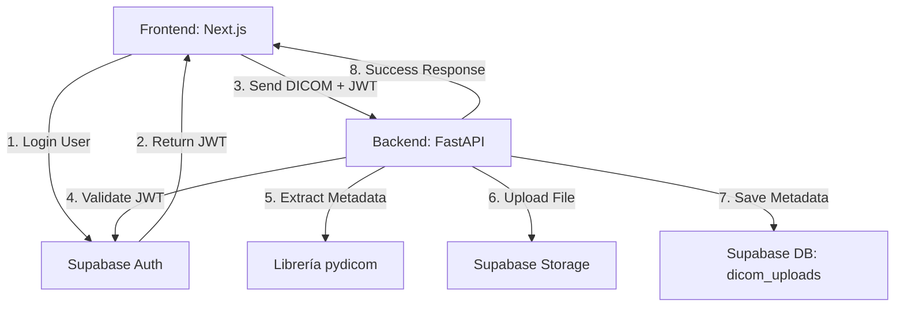

# Análisis de Arquitectura y Código: OncaScan Platform||

## 1. Arquitectura General

La plataforma utiliza una arquitectura **Cliente-Servidor desacoplada** dentro de un esquema de **Monorepo**. 

- **Frontend (Cliente):** Aplicación web responsiva.
- **Backend (Servidor):** API RESTful que maneja la lógica de negocio pesada y el procesamiento de archivos médicos.
- **BaaS (Backend as a Service):** **Supabase** actúa como el núcleo de infraestructura manejando tres pilares fundamentales:
  1. **Autenticación (Auth):** Emisión y validación de JWT.
  2. **Base de Datos (Database PostgreSQL):** Almacenamiento estructurado de registros e historial (ej. tabla `dicom_uploads`).
  3. **Almacenamiento (Storage):** Guardado de archivos binarios pesados (archivos DICOM).

### Diagrama Lógico de Conexión



---

## 2. Estructura del Código (Monorepo)

El repositorio está organizado lógica y modularmente:

```text
Benditos_cancer_detector/
├── apps/
│   ├── api/       # Aplicación Backend (FastAPI / Python)
│   └── web/       # Aplicación Frontend (Next.js / TypeScript)
├── docs/          # Documentación técnica y seguimiento del MVP
├── README.md      # Información general del proyecto
└── package.json / package-lock.json (raíz)
```

### A. Frontend (`apps/web`)

Desarrollado con **Next.js 16**, **React 19**, **TypeScript** y **Tailwind CSS**.

- **Enrutamiento (App Router):** Usa la carpeta `src/app`.
  - `/login`: Vista pública para autenticación.
  - `/platform`: Área privada que contiene rutas o subcomponentes para subir (`/platform/upload`) y consultar (`/platform/uploads`) archivos.
- **Autenticación:** Usa `@supabase/ssr` para verificar las sesiones mediante *Cookies/Middleware* (`src/proxy.ts` y middleware de autenticación), bloqueando usuarios no autorizados antes de renderizar la plataforma.
- **UI:** Interfaz de usuario enriquecida usando clases utilitarias (Tailwind) e iconos (`lucide-react`).

### B. Backend (`apps/api`)

Desarrollado en **Python**, usando el framework **FastAPI**. El código está en `apps/api/app`.

- **`main.py`:** Punto de entrada de la aplicación. Configura CORS, define la especificación Swagger/OpenAPI y registra los routers (Rutas de la API).
- **`core/security.py`:** Contiene la lógica vital `get_current_user`. Extrae el token "Bearer" de la petición HTTP recibida y consulta a `Supabase Auth` para validar si el token es legítimo y pertenece a un usuario activo.
- **`db/supabase_client.py`:** Instancia el cliente de Supabase usado por el backend (usando las variables de entorno para la URL y la Key de servicio).
- **`api/v1/routers/dicom.py`:** El corazón de la aplicación en este MVP.
  1. Recibe el archivo `.dcm` a través de un form-data.
  2. Pasa por la dependencia `get_current_user` (requiere autenticación).
  3. Usa la librería médica **`pydicom`** para leer el archivo y extraer metadatos sin cargar toda la imagen en RAM (`stop_before_pixels=True`). Extrae: `Modality`, `StudyDate` y `PatientID`.
  4. Sube el archivo original al bucket de Supabase Storage.
  5. Inserta un registro en la tabla `dicom_uploads` de Supabase con los metadatos y la ruta de acceso (storage_path).

### C. Documentación (`docs/`)
Se nota una fuerte cultura de documentación. Contiene guías de inicialización (`setup-nuevo-pc.md`), progreso del sistema (`mvp_status.md`) y despliegue (`deploy.md`, `smoke-test.md`).

---

## 3. ¿Cómo funciona y cómo se conecta todo?

### El Flujo de Trabajo (Paso a paso)

1. **El Usuario inicia sesión:** El usuario ingresa a la web y se loguea. El Frontend contacta directamente a Supabase Auth. Si las credenciales son válidas, el usuario recibe un **Token JWT**.
2. **Navegación Protegida:** El usuario entra a `/platform`. El Next.js Middleware revisa las cookies para asegurar que la sesión es válida.
3. **Carga de Archivos (Upload DICOM):**
   - El usuario selecciona un archivo y presiona subir.
   - El Frontend toma el archivo y el **Token JWT**, y hace una petición HTTP `POST` hacia la URL del Backend (`/api/v1/dicom/upload`), enviando el token en el Header: `Authorization: Bearer <TOKEN>`.
4. **Procesamiento y Seguridad en el Backend:**
   - FastAPI intercepta la petición. Antes de procesar el archivo, invoca `security.py`, que envía el token a Supabase para cerciorarse de que no esté expirado y que corresponda a un usuario real.
   - Si es válido, FastAPI guarda la imagen DICOM temporalmente en el servidor, abre la cabecera usando Python (`pydicom`) y extrae los metadatos médicos importantes.
5. **Persistencia de Datos:**
   - El backend toma el archivo crudo DICOM y lo envía al Bucket privado `dicom-files` en Supabase Storage.
   - El backend toma el ID del usuario (`user_id`), los metadatos extraídos y genera una fila en la base de datos relacional de Supabase (`dicom_uploads`).
6. **Confirmación:** El Frontend recibe el aviso de éxito y redirige o actualiza el "Historial de Cargas".

## 4. Tecnologías Principales y su Propósito
- **Next.js:** Server-Side Rendering (SSR) y generación de UI rápida.
- **FastAPI (Python):** Extremadamente rápido para microservicios y nativo para integrarse con librerías científicas y de Inteligencia Artificial como `pydicom` (y eventualmente PyTorch/TensorFlow).
- **Supabase:** Unifica la base de datos Postgres (Metadata), Storage (DICOM files) y Auth, evitando tener que configurar y mantener tres servicios separados.
- **Vercel & Railway:** Plataformas Plataform-as-a-Service (PaaS). Vercel aloja el Frontend estático/transpilado y Railway se encarga de ejecutar el servidor de Python (FastAPI).

## 5. Próximos pasos lógicos desde esta arquitectura
El equipo ha creado una base sólida de pre-procesamiento. Ya que el motor de extracción funciona y los archivos se almacenan correctamente bajo un registro por usuario, la arquitectura está completamente lista para integrar un **Worker o Módulo de IA** en el backend (FastAPI). 
Este módulo podría:
1. Tomar el DICOM recién subido.
2. Pasarlo por un modelo preentrenado (ej. ResNet para pulmón).
3. Escribir el resultado en una nueva columna en la tabla `dicom_uploads` o en una nueva tabla `ai_predictions`.
