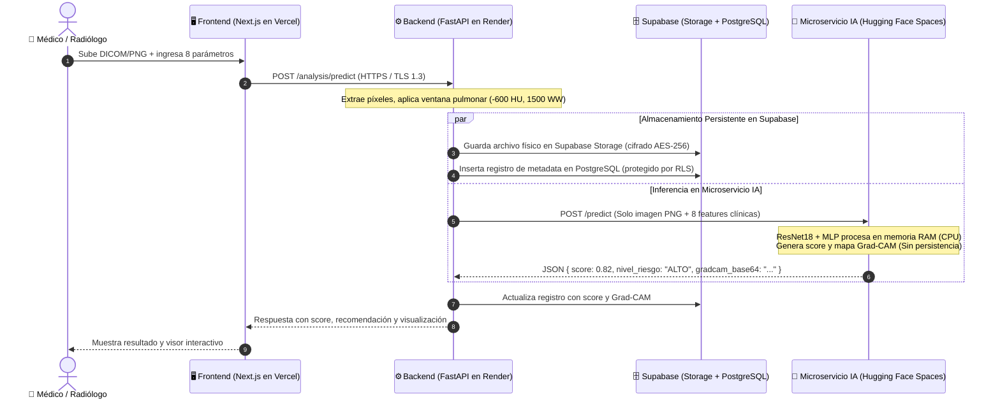

# OncoScan — Flujo de Datos, Privacidad Médica y Fundamentación de LIDC-IDRI para Patología

> **Documento Técnico de Soporte para la Defensa y Auditoría Clínica**  
> **Fecha:** Octubre 2026  
> **Proyecto:** OncoScan Platform — Detección Temprana de Cáncer de Pulmón  
> **Audiencia:** Equipo de Desarrollo, Docente Evaluador y Especialista en Patología

---

## 1. Flujo de Datos y Trazabilidad en la Arquitectura Actual

En OncoScan, el procesamiento de un estudio tomográfico sigue una ruta dividida en **4 componentes interconectados**:

### ¿Dónde residen los datos exactamente?
1. **Supabase Storage:** Almacena el archivo físico original (`.dcm` o `.png`).
2. **Supabase Database (PostgreSQL):** Almacena la metadata (`id`, `user_id` del médico, fecha, las 8 características clínicas del nódulo y el resultado numérico de la IA).
3. **Microservicio Hugging Face Spaces (`luisdam-oncoscan-ai`):** **No almacena datos en disco ni en base de datos.** Recibe los píxeles procesados y los 8 números en la memoria RAM del contenedor, ejecuta la pasada hacia adelante de la red neuronal y el Grad-CAM, devuelve el JSON y libera la memoria.

---

## 2. Estrategia de Privacidad y Protección de Datos Médicos (PHI)

Para cumplir con la **Ley 1581 de 2012 de Colombia (Habeas Data)** y estándares internacionales como **HIPAA**, la privacidad del paciente se estructura en **4 capas complementarias**:

### Capa 1: Anonimización de Cabeceras DICOM en Origen *(De-identification)*
Un archivo tomográfico DICOM nativo incluye metadatos personales (*Protected Health Information* - PHI):
* `(0010,0010) PatientName`
* `(0010,0020) PatientID` (cédula o historia clínica)
* `(0010,0030) PatientBirthDate`
* `(0008,0080) InstitutionName` (clínica o centro hospitalario)
* `(0008,0090) ReferringPhysicianName` (médico tratante)

**Mecanismo de protección:**  
Antes de almacenar el estudio, la cabecera es despojada de todo campo de identificación personal. El archivo se renombra con un identificador hash aleatorio (UUIDv4) y **únicamente se preservan los parámetros de física radiológica** indispensables para calibrar los valores Hounsfield:
* `(0028,1052) RescaleIntercept`
* `(0028,1053) RescaleSlope`
* `(0028,1050) WindowCenter`
* `(0028,1051) WindowWidth`

### Capa 2: Cifrado en Tránsito y en Reposo
* **En Tránsito:** Todas las conexiones externas e internas se realizan bajo protocolo **HTTPS con cifrado TLS 1.3**, impidiendo ataques de intermediario (*Man-in-the-Middle*) dentro de la red hospitalaria.
* **En Reposo:** Los archivos almacenados en Supabase Storage y las tablas de base de datos se encuentran cifrados bajo el estándar **AES-256**.

### Capa 3: Aislamiento por Usuario *(Row-Level Security - RLS)*
En la base de datos PostgreSQL, las políticas de RLS garantizan aislamiento absoluto:
* Cada consulta verifica el token JWT emitido por `auth.users`.
* La regla de seguridad estipula que un especialista solo puede consultar (`SELECT`) o modificar (`UPDATE`) los registros donde `user_id = auth.uid()`. Un radiólogo de una institución nunca puede acceder a los estudios subidos por otro profesional.

### Capa 4: Política de Retención Efímera *(Zero-Retention Mode)*
Para instituciones con políticas de máxima seguridad donde los datos biomédicos no pueden residir en nubes públicas:
* Se habilita el procesamiento en memoria volátil: la tomografía se analiza en la memoria RAM del backend, se genera el reporte y el archivo es purgado inmediatamente sin guardarse en almacenamiento permanente.

### Capa 5 (Horizonte Futuro): Aprendizaje Federado y Enclaves TEEs
*Siguiendo la publicación de Google Research (octubre de 2026): "Toward provably private learning from federated data"*:  
Para el reentrenamiento y mejora continua de OncoScan entre múltiples hospitales (ej. HUV, Valle del Lili, Imbanaco), la arquitectura futura adoptará **Aprendizaje Federado (Federated Learning)** ejecutado en **Entornos de Ejecución Confiable (TEEs)**. Los hospitales entrenarán el modelo de forma local y solo compartirán gradientes agregados con privacidad diferencial, sin que una sola tomografía abandone la red del hospital.

---

## 3. Radiografía del Dataset LIDC-IDRI para la Patóloga

Un especialista en patología evalúa los proyectos de IA bajo el principio del **Gold Standard histológico** (biopsia tisular, inmunohistoquímica y tipificación celular).

### 3.1 Composición General de LIDC-IDRI
* **Institución:** Creado por el *National Cancer Institute* (NCI) y centros universitarios de EE.UU.
* **Volumen:** **1,010 pacientes únicos** y 1,018 estudios tomográficos helicoidales de tórax.
* **Equipamiento:** Tomógrafos de 4 fabricantes principales (GE, Siemens, Philips, Toshiba) con espesores de corte entre $0.6\text{ mm}$ y $5.0\text{ mm}$.
* **Lesiones documentadas en el banco:**
  * **Nódulos $\ge 3\text{ mm}$:** ~2,624 nódulos únicos caracterizados en contorno 3D y evaluados morfológicamente.
  * **Micronódulos $< 3\text{ mm}$:** Lesiones pequeñas donde el tomógrafo no permite definir márgenes de forma confiable (solo se registró su centroide).
  * **No-nódulos $\ge 3\text{ mm}$:** Hallazgos que simulan nódulos pero corresponden a atelectasias, placas pleurales, engrosamientos apicales o cruces vasculares.

### 3.2 ¿Cuántos pacientes estaban realmente enfermos? (La verdad histológica)
Es fundamental ser transparentes sobre la naturaleza del dataset:
1. **LIDC-IDRI es un banco de tamizaje y diagnóstico por imagen, no un registro quirúrgico masivo.**
2. En los metadatos de TCIA (*The Cancer Imaging Archive*), **solo 157 pacientes cuentan con confirmación histopatológica por biopsia o cirugía**:
   * **~98 pacientes con cáncer maligno confirmado histológicamente:** Predominio de Adenocarcinoma, Carcinoma Escamocelular y Carcinomas de células grandes (NSCLC).
   * **~59 pacientes con patología benigna demostrada:** Granulomas infecciosos (secuelas de tuberculosis o micosis), hamartomas o nódulos con estabilidad volumétrica comprobada durante más de 2 años.
3. Para los restantes ~850 pacientes, la verdad del dataset proviene del **consenso radiológico independiente de 4 especialistas torácicos**.

### 3.3 El Subconjunto de OncoScan
* Se utilizó la cohorte procesada de **875 pacientes**.
* **Filtro de Consenso Estricto:**
  * **Clase Positiva (1 - Nódulo):** Cortes axiales donde **los 4 radiólogos (acuerdo del 100%)** delimitaron unánimemente la lesión.
  * **Clase Negativa (0 - Sin nódulo):** Cortes de parénquima pulmonar donde al menos **3 de los 4 radiólogos** certificaron la ausencia de lesión.
  * **Cortes con desacuerdo (1/4 o 2/4):** Se descartaron para eliminar ambigüedad y ruido en las etiquetas de entrenamiento.
* **Conjunto de prueba independiente evaluado:** 687 tomografías (296 con nódulo verificado y 391 sin nódulo), alcanzando una exactitud de **89.8%**, sensibilidad de **91.6%** y **AUC de 0.950**.

---

## 4. Correlación Histopatológica de las 8 Variables del Formulario

Cuando la patóloga pregunte qué representan los parámetros en el tejido humano, esta es la correspondencia biológica:

| Parámetro | Escala | Correlación Histopatológica y Tisular |
| :--- | :---: | :--- |
| **Espiculación (`spiculation`)** | 1–5 | **El correlato patológico más contundente de malignidad.** En el microscopio corresponde a **desmoplasia estromal** (reacción fibrótica densa) e infiltración tumoral que invade los septos interalveolares y los canales linfáticos peribroncovasculares (*corona radiata*). |
| **Calcificación (`calcification`)** | 1–6 | Calcificaciones laminares, centrales o en "palomitas de maíz" indican patología benigna inactiva (hamartomas o granulomas antiguos calcificados). En carcinomas activos primarios la calcificación suele estar **ausente (valor 6)** o presentarse como microcalcificaciones distróficas amorfas. |
| **Lobulación (`lobulation`)** | 1–5 | Contornos lobulados reflejan tasas heterogéneas de proliferación celular entre diferentes clones tumorales dentro de la misma masa, o atrapamiento contra estructuras conectivas preexistentes. |
| **Textura (`texture`)** | 1–5 | Nódulos en vidrio deslustrado (GGO, no sólidos) suelen correlacionar con adenocarcinoma *in situ* o hiperplasia adenomatosa atípica (patrón de crecimiento lepídico a lo largo de las paredes alveolares sin invasión estromal). La aparición de un componente sólido central marca invasión fibroblástica. |
| **Margen (`margin`)** | 1–5 | Márgenes difusos o poco definidos denotan bordes infiltrativos donde las células neoplásicas invaden activamente el espacio alveolar circundante. |
| **Esfericidad (`sphericity`)** | 1–5 | Nódulos geométricamente esféricos y homogéneos suelen orientar hacia benignidad o metástasis hematógena secundaria; los carcinomas broncogénicos primarios típicamente exhiben crecimiento asimétrico e irregular. |
| **Sutileza (`subtlety`)** | 1–5 | Grado de diferenciación de atenuación entre la lesión y el parénquima aéreo pulmonar. |
| **Sospecha (`malignancy`)** | 1–5 | Criterio radiológico semicuantitativo global asignado por los especialistas. |

---

## 5. Guion de Respuesta y Defensa ante la Patóloga

Utilizar este marco de comunicación durante la presentación:

> *"Doctora, reconocemos que en oncología **el único estándar de oro absoluto para el diagnóstico de certeza es la histopatología mediante biopsia o resección quirúrgica**. OncoScan no busca reemplazar la biopsia ni predecir la estirpe celular en el microscopio.
>
> OncoScan opera como una herramienta de **triaje y priorización temprana en tomografía computarizada**. 
>
> Entrenamos el sistema con el banco LIDC-IDRI del Instituto Nacional del Cáncer. Dado que en este repositorio solo un grupo de 157 casos cuenta con correlación anatomopatológica confirmada (adenocarcinomas, carcinomas escamocelulares y granulomas), nuestro estándar de referencia para el modelo de tamizaje fue el **consenso unánime de 4 radiólogos torácicos certificados**. 
>
> El valor clínico del sistema reside en detectar oportunamente nódulos con alta sospecha biológica (por ejemplo, aquellos con espiculación por reacción desmoplásica y ausencia de calcificaciones benignas) para que el paciente sea **remitido con máxima celeridad al servicio de neumología y patología**, reduciendo los tiempos de espera que hoy retrasan el diagnóstico definitivo."*

---

## 6. Documentos Complementarios de Soporte

1. **[Plan de Trabajo y Ejecución Técnica (Semana Entrante)](./plan-trabajo-semana-entrante.md):** Contiene la integración de las referencias enviadas por el docente (Google Research FL/TEEs, FreeCodeCamp CLAHE/Letterboxing, Lunit INSIGHT MMG) y el cronograma técnico día a día para entrenar el modelo v1.2.
2. **[Evaluación Oficial Modelo v1.1 y Plan Estratégico v1.2](./evaluacion-v1.1-plan-v1.2.md):** Ficha técnica oficial de `multimodal-v1.1`, resultados del Test Set de 687 casos y análisis de umbrales de decisión.

