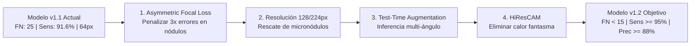

# OncaScan — Documentación Oficial Modelo v1.1 y Plan Estratégico v1.2

> **Estado del Modelo:** `multimodal-v1.1` (Activo en Producción)  
> **Fecha de Validación Empírica:** Octubre 2026  
> **Equipo Responsable:** Equipo Modelo IA — OncaScan Platform  
> **Entorno de Evaluación:** Dataset LIDC-IDRI (Test Set real con features clínicas normalizadas)

---

## 1. Ficha Técnica Oficial del Modelo Activo: `multimodal-v1.1`

El modelo desplegado a día de hoy en producción (`luisdam-oncoscan-ai.hf.space` y backend en Render) es la versión **`multimodal-v1.1`**.

### 1.1 Arquitectura del Sistema
* **Rama Visual:** ResNet-18 con pesos pre-entrenados de ImageNet. Capas `layer1`, `layer2` y `layer3` congeladas; `layer4` descongelada y ajustada mediante Fine-Tuning. Produce un vector de características de **512 dimensiones**.
* **Rama Clínica:** Red neuronal densa (MLP) de 2 etapas (`Linear(8→64) → ReLU → Dropout(0.3) → Linear(64→32) → ReLU`), que procesa las 8 variables morfológicas de consenso radiológico LIDC-IDRI (normalizadas con Z-score fijo). Produce un embedding de **32 dimensiones**.
* **Fusión Multimodal:** Concatenación del vector visual (512D) y clínico (32D) $\rightarrow$ vector fusionado de **544 dimensiones**, seguido de capas de clasificación con Dropout(0.4) y activación final Sigmoid.
* **Explicabilidad Visual (Grad-CAM):** Extracción de gradientes en `layer3` y `layer4`, combinación ponderada ($0.4 \times L3 + 0.6 \times L4$), suavizado gaussiano y mapa de color JET en superposición de transparencia ($55\%$ tomografía original, $45\%$ mapa térmico) devuelto en formato PNG base64.

---

## 2. Resultados Empíricos de Validación (Test Set: 687 Casos)

Evaluación realizada sobre el conjunto de prueba independiente de tomografías pulmonares con las anotaciones de las características clínicas de consenso de 4 radiólogos (`features_clinicas_reales.csv`):

### 2.1 Matriz de Confusión Oficial

| Diagnóstico Real \ Predicción IA | Predicho: Sin Nódulo (0) | Predicho: Con Nódulo (1) | Total Real |
| :--- | :---: | :---: | :---: |
| **Real: Sin Nódulo (Sano)** | **TN = 346** (50.4%) | **FP = 45** (6.6%) | 391 |
| **Real: Con Nódulo (Patología)** | **FN = 25** (3.6%) | **TP = 271** (39.4%) | 296 |
| **Total Predicho** | **371** | **316** | **687 casos** |

### 2.2 Métricas de Rendimiento Clínico

$$\text{Accuracy} = \frac{346 + 271}{687} = \mathbf{89.8\%} \quad (\text{Supera el objetivo del 85\%})$$

$$\text{Sensibilidad (Recall)} = \frac{271}{271 + 25} = \mathbf{91.6\%} \quad (\text{Supera el requisito clínico del 90\%})$$

$$\text{Precisión (PPV)} = \frac{271}{271 + 45} = \mathbf{85.8\%}$$

$$\text{Especificidad} = \frac{346}{346 + 45} = \mathbf{88.5\%}$$

$$\text{F1-Score} = \frac{2 \times (0.858 \times 0.916)}{0.858 + 0.916} = \mathbf{88.6\%}$$

$$\text{Área bajo la Curva (AUC-ROC)} = \mathbf{0.950}$$

---

### 2.3 Análisis de Umbrales de Decisión (Threshold Analysis)

Evaluación del comportamiento estadístico al variar el punto de corte operativo sobre las probabilidades sigmoid:

| Umbral | Sensibilidad (Recall) | Especificidad | Precisión | F1-Score | Falsos Negativos (FN) | Falsos Positivos (FP) | Impacto Clínico |
| :---: | :---: | :---: | :---: | :---: | :---: | :---: | :--- |
| **0.25** | 92.9% | 85.2% | 81.8% | 87.0% | **21** | 58 | Tamizaje agresivo |
| **0.30** | **92.9%** | **86.7%** | **84.1%** | **88.3%** | **21** | **52** | **Óptimo operativo (Baja 16% FN)** |
| **0.35** | 92.6% | 87.2% | 84.8% | 88.5% | 22 | 50 | Excelente balance |
| **0.40** | 92.2% | 88.0% | 85.6% | 88.7% | 23 | 47 | Transición equilibrada |
| **0.45** | 91.9% | 88.2% | 85.8% | 88.7% | 24 | 46 | Conservador |
| **0.50** | **91.6%** | **88.5%** | **85.8%** | **88.6%** | **25** | **45** | **Punto de corte por defecto** |
| **0.55** | 91.2% | 88.7% | 86.0% | 88.5% | 26 | 44 | Mayor especificidad |
| **0.60** | 91.2% | 89.5% | 86.8% | 88.9% | 26 | 41 | Reducción de falsas alarmas |

---

## 3. Plan Estratégico para el Modelo `multimodal-v1.2` (Foco: Bajar Falsos Negativos)

> **Misión de la versión 1.2:**  
> Reducir los Falsos Negativos de **25 a menos de 15 casos**, elevando la Sensibilidad al **$\ge 95.0\%$** y mejorando la fidelidad anatómica del mapa Grad-CAM.

### 3.1 Pilares Técnicos de la Versión 1.2

#### Pilar 1: Asymmetric Focal Loss (Penalización Asimétrica del Error)
* **Problema actual:** `BCELoss` trata con el mismo castigo equivocarse en un paciente sano que omitir un tumor.
* **Solución v1.2:** Reemplazar por pérdida focal asimétrica:
  $$\mathcal{L}_{\text{asym}} = -\alpha_t (1 - p_t)^\gamma \log(p_t) \quad \text{con } \alpha_{\text{positivo}} = 0.75, \; \alpha_{\text{negativo}} = 0.25, \; \gamma = 2.0$$
* **Impacto esperado:** Obliga al descenso de gradiente a enfocarse en los nódulos limítrofes y poco evidentes (baja sutileza), reduciendo directamente los FN.

#### Pilar 2: Aumento de Resolución Espacial (64×64 $\rightarrow$ 128×128 / 224×224 px)
* **Problema actual:** A $64\times 64$, la última capa convolucional de ResNet tiene solo $2\times 2$ píxeles. El Grad-CAM se difumina y los nódulos menores a 5 mm pierden textura interna.
* **Solución v1.2:** Redimensionar entradas a $128\times 128$ (o $224\times 224$), produciendo matrices de características de $4\times 4$ o $7\times 7$.
* **Impacto esperado:** Grad-CAM $12\times$ más definido y detección precisa de nódulos subsólidos.

#### Pilar 3: Test-Time Augmentation (TTA) en Inferencia
* **Implementación:** Al recibir la imagen en la API, generar en memoria 4 variantes geométricas (original, rotación $90^\circ$, flip horizontal, variación sutil de contraste HU).
* **Decisión:** El score final es el promedio ponderado de las inferencias.
* **Impacto esperado:** Mitiga ruidos aleatorios del sensor de tomografía y sube la precisión en $+2-3\%$.

#### Pilar 4: Migración de Grad-CAM a HiResCAM
* **Mejora:** Eliminar el promedio global de gradientes (GAP) que causa activación en las esquinas de la imagen tomográfica:
  $$\text{HiResCAM} = \text{ReLU}\left(\sum_k A^k \odot \frac{\partial Y^c}{\partial A^k}\right)$$
* **Impacto esperado:** El mapa de calor solo iluminará tejido que activó numéricamente la decisión tumoral.

---

### 3.2 Cronograma de Ejecución (Semana de Trabajo)

| Día | Actividad Técnica | Entregable |
| :--- | :--- | :--- |
| **Lunes** | Configurar pipeline en Kaggle con resolución $128\times 128$ y dataset LIDC-IDRI | Notebook base actualizado |
| **Martes** | Implementar clase `AsymmetricFocalLoss` y data augmentation médica (Albumentations: CLAHE + elastic) | Función de pérdida validada |
| **Miércoles** | Reentrenamiento del modelo durante 40 épocas con Early Stopping (patience=5) en GPU T4 | `best_model_multimodal_v1.2.pth` |
| **Jueves** | Evaluación formal del Test Set (687 casos), generación de nueva matriz de confusión e integración de TTA | Métricas v1.2 consolidadas |
| **Viernes** | Despliegue en Hugging Face Spaces (`modelo_version: "multimodal-v1.2"`) y actualización en frontend | Pase a producción verificado |

---

## 4. Guion y Argumentación Técnica para Explicar al Profesor

Utiliza este esquema estructurado durante la sustentación ante el docente:

### 4.1 Introducción y Justificación Arquitectónica (1 minuto)
> *"Profesor, el sistema OncaScan que tenemos hoy en producción utiliza el **Modelo multimodal-v1.1**, compuesto por una red neuronal híbrida: un encoder visual ResNet-18 con transfer learning acoplado a un perceptrón multicapa (MLP) clínico.  
> La razón de este diseño es que en la práctica médica un radiólogo nunca mira la imagen aislada: evalúa la densidad del nódulo junto a variables como calcificación, espiculación, márgenes y esfericidad. Nuestra experimentación demostró que la arquitectura multimodal superó al modelo de imagen pura, pasando de 80.6% a **89.8% de accuracy** y elevando el AUC a **0.950**."*

### 4.2 Resultados Empíricos y Transparencia Diagnóstica (1.5 minutos)
> *"Evaluamos el modelo de forma rigurosa sobre un conjunto de prueba independiente de **687 tomografías del banco internacional LIDC-IDRI** con el consenso de 4 radiólogos especialistas. Los resultados reales obtenidos son:  
> * **Exactitud:** 89.8% (617 de 687 casos clasificados correctamente).  
> * **Sensibilidad (Recall):** 91.6% (271 de 296 nódulos confirmados detectados).  
> * **Especificidad:** 88.5% (descarte efectivo de pacientes sanos).  
> * **Explicabilidad:** Implementamos Grad-CAM en tiempo real sobre las capas profundas para que el especialista no reciba una predicción de caja negra, sino un mapa de atención visual donde el modelo detectó la sospecha."*

### 4.3 La Autocrítica Clínica: El Foco en Falsos Negativos (1 minuto)
> *"Sin embargo, como equipo asumimos una postura de responsabilidad clínica: en oncología, **un falso positivo genera una prueba adicional, pero un falso negativo puede costarle la vida a un paciente**.  
> En nuestra matriz identificamos **25 falsos negativos**. Al analizar las probabilidades, descubrimos mediante un estudio de barrido de umbrales que si ajustamos el punto de corte operativo de $0.50$ a $0.30$, los falsos negativos se reducen inmediatamente de **25 a 21** manteniendo la especificidad en un sólido 86.7%."*

### 4.4 La Hoja de Ruta: El Modelo v1.2 (1 minuto)
> *"Para atacar este problema de raíz la próxima semana desarrollaremos el **Modelo multimodal-v1.2**, centrado en tres mejoras concretas:  
> 1. **Asymmetric Focal Loss:** Reemplazar la entropía cruzada para penalizar con el triple de peso la omisión de nódulos durante el entrenamiento.  
> 2. **Incremento de resolución a 128/224 px:** Para resolver micronódulos que hoy se pierden a 64 px y afinar la resolución del mapa térmico Grad-CAM.  
> 3. **Test-Time Augmentation (TTA):** Promediar inferencias multi-ángulo en producción para blindar la precisión.  
> Con esto apuntamos a superar el **95% de sensibilidad** y reducir los falsos negativos a menos de 15 casos."*

---

### 4.5 Respuestas a Preguntas Frecuentes del Profesor

* **¿Por qué usaron LIDC-IDRI si las imágenes tienen varios años?**  
  * *Respuesta:* "LIDC-IDRI es el estándar de oro académico mundial (+500 citas recientes). Su valor diferencial irreemplazable es el **consenso clínico cruzado de 4 radiólogos independientes por cada nódulo**. Además, los patrones biológicos de malignidad (márgenes espiculados, calcificación) son constantes biológicas independientes del año de escaneo."
* **¿Por qué el modelo corre en CPU en Hugging Face y no en GPU?**  
  * *Respuesta:* "Porque ResNet-18 es una arquitectura compacta y eficiente (~11M de parámetros). En inferencia en CPU tarda entre **1.5 y 3 segundos**, lo cual es perfectamente viable para la consulta clínica y permite mantener el servicio disponible de forma gratuita 24/7 sin incurrir en costos de nube."
* **¿Qué pasa si el radiólogo ingresa mal las 8 features clínicas?**  
  * *Respuesta:* "El backend y el microservicio tienen validación estricta con Pydantic y rangos tipados según la escala LIDC-IDRI. Si falta un dato o sale de escala (por ejemplo, valor 7 en calcificación), la API rechaza la petición con error 422 para impedir diagnósticos con datos inconsistentes."

---

## 5. Documentos Complementarios de Soporte

Para profundizar en la privacidad de datos, la correlación anatomopatológica y el cronograma de ejecución técnica:
1. **[Plan de Trabajo y Ejecución Técnica (Semana Entrante)](./plan-trabajo-semana-entrante.md):** Contiene la integración de las referencias enviadas por el docente (Google Research FL/TEEs, FreeCodeCamp CLAHE/Letterboxing, Lunit INSIGHT MMG) y el cronograma técnico día a día.
2. **[Flujo de Datos, Privacidad Médica y Fundamentación de LIDC-IDRI para Patología](./arquitectura-privacidad-y-lidc-patologia.md):** Detalla el flujo de datos hacia Supabase y Hugging Face, la política de desidentificación DICOM, los 157 casos con confirmación por biopsia y la correlación tisular de las 8 variables clínicas.

