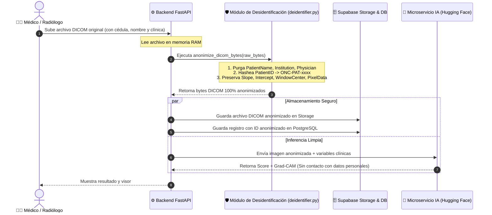

# OncoScan — Plan de Anonimización de Datos DICOM y Estrategia de Feedback Clínico
## Cumplimiento de Privacidad (DICOM PS 3.15 / Ley 1581) y Ciclo de Aprendizaje Activo (Active Learning)

> **Documento Técnico y Estratégico**  
> **Fecha:** Octubre 2026  
> **Proyecto:** OncoScan Platform — Detección Temprana de Cáncer de Pulmón  
> **Autores:** Equipo de Desarrollo (Luis & Juan)  
> **Destinatarios:** Docente Asesor, Médica Patóloga y Equipo de Ingeniería

---

## 1. Justificación y Marco Normativo de la Anonimización

En aplicaciones de Inteligencia Artificial Médica, el procesamiento de estudios radiológicos sin anonimización previa constituye una violación directa de los derechos fundamentales del paciente y del marco legal:

* **Colombia — Ley Estatutaria 1581 de 2012 (Habeas Data):** Las imágenes diagnósticas y las historias clínicas son **datos sensibles de salud** (Art. 5). Su tratamiento exige anonimización o consentimiento expreso calificado.
* **Resolución 1995 de 1999 (MinSalud Colombia):** Regula la custodia y reserva legal de la historia clínica.
* **Estándar Internacional — DICOM PS 3.15 (Anexo E):** *Basic Application Level Confidentiality Profile*. Es el protocolo estándar global para desidentificar imágenes médicas garantizando que no queden datos personales residuales en cabeceras binarias ni metadatos privados.
* **HIPAA Safe Harbor (EE.UU.):** Especifica los 18 identificadores directos e indirectos que deben ser eliminados antes de compartir datos de salud.

---

## 2. Matriz de Tratamiento de Etiquetas DICOM (PHI vs Física Radiológica)

El desafío en radiología computacional radica en **eliminar el 100% de la información personal protegida (PHI)** sin alterar los **parámetros de física de imagen** indispensables para que la red neuronal convolucional (ResNet-18) y el mapa de explicabilidad (Grad-CAM/HiResCAM) operen con precisión.

### 2.1 Etiquetas de Identificación Personal (A Purgar o Seudonimizar)

| Tag DICOM | Nombre del Atributo | Acción Aplicada | Justificación Clínica / Legal |
| :--- | :--- | :---: | :--- |
| `(0010,0010)` | `PatientName` | **Reemplazar por `"ONCOSCAN-ANON"`** | Elimina nombre y apellidos completos del paciente. |
| `(0010,0020)` | `PatientID` | **Hash Criptográfico (`HMAC-SHA256`)** | Genera un ID anónimo (`ONC-PAT-xxxx`). Permite seguimiento longitudinal del mismo paciente sin revelar su cédula. |
| `(0010,0030)` | `PatientBirthDate` | **Truncar a solo Año (o Edad en años)** | Elimina día y mes para impedir reidentificación cruzada con censos o bases públicas; preserva el grupo etario. |
| `(0010,0040)` | `PatientSex` | **Preservar (`M` / `F` / `O`)** | Variable biológica relevante para epidemiología de cáncer pulmonar. |
| `(0008,0080)` | `InstitutionName` | **Purgar (Vaciar)** | Oculta la clínica o centro hospitalario de origen. |
| `(0008,0081)` | `InstitutionAddress` | **Purgar (Vaciar)** | Oculta la ubicación geográfica del paciente. |
| `(0008,0090)` | `ReferringPhysicianName`| **Purgar (Vaciar)** | Elimina el nombre del médico que ordenó el estudio. |
| `(0008,1050)` | `PerformingPhysicianName`| **Purgar (Vaciar)** | Elimina el nombre del radiólogo que tomó la tomografía. |
| `(0008,1070)` | `OperatorsName` | **Purgar (Vaciar)** | Elimina el nombre del tecnólogo en imágenes diagnósticas. |
| `(0008,1030)` | `StudyDescription` | **Sanitizar a `"TAC TORAX"`** | Elimina textos libres donde los operadores suelen escribir nombres o diagnósticos preliminares. |
| `(0010,1000)` | `OtherPatientIDs` | **Purgar (Vaciar)** | Elimina identificadores secundarios o números de póliza. |
| `(0010,4000)` | `PatientComments` | **Purgar (Vaciar)** | Elimina comentarios libres del personal de salud. |
| `Tags Privados` | `(xxxx,xxxx)` con grupo impar | **Purgar Completamente** | Fabricantes (GE, Siemens, Philips) insertan metadatos propietarios no estándar que pueden incluir nombres o seriales. |

---

### 2.2 Parámetros de Física Radiológica (A Preservar Intactos)

Si cualquiera de estos parámetros es alterado o eliminado, la red neuronal fallará en calibrar las densidades tisulares:

| Tag DICOM | Nombre del Atributo | Propósito en el Pipeline de OncoScan |
| :--- | :--- | :--- |
| `(0028,1052)` | `RescaleIntercept` | Transforma los valores de brillo nativos del sensor a Unidades Hounsfield ($\text{HU} = \text{Pixel} \times \text{Slope} + \text{Intercept}$). |
| `(0028,1053)` | `RescaleSlope` | Pendiente de conversión a escala Hounsfield real. |
| `(0028,1050)` | `WindowCenter` | Centro de la ventana pulmonar radiológica (típicamente $-600\text{ HU}$). |
| `(0028,1051)` | `WindowWidth` | Ancho de la ventana pulmonar radiológica (típicamente $1500\text{ HU}$). |
| `(0028,0030)` | `PixelSpacing` | Distancia física en milímetros entre píxeles adyacentes ($x, y$); vital para medir el diámetro real del nódulo. |
| `(0018,0050)` | `SliceThickness` | Grosor del corte tomográfico (ej. $1.0\text{ mm}$ o $2.5\text{ mm}$). |
| `(0028,0010)` | `Rows` | Altura de la matriz en píxeles ($512$). |
| `(0028,0011)` | `Columns` | Ancho de la matriz en píxeles ($512$). |
| `(7FE0,0010)` | `PixelData` | La matriz pura de atenuación de rayos X (los vóxeles del paciente). |

---

## 3. Algoritmo de Seudonimización Criptográfica Irreversible

Para evitar almacenar la cédula de ciudadanía o el ID hospitalario en Supabase:

```python
import hmac
import hashlib

def pseudonymize_patient_id(raw_patient_id: str, secret_salt: str) -> str:
    """
    Genera un seudónimo clínico determinista pero matemáticamente irreversible.
    Ejemplo: 'CC-1144123456' -> 'ONC-PAT-9f82a1c0d4'
    """
    key = secret_salt.encode("utf-8")
    msg = raw_patient_id.strip().encode("utf-8")
    digest = hmac.new(key, msg, hashlib.sha256).hexdigest()[:12]
    return f"ONC-PAT-{digest.upper()}"
```

### Ventajas Clínicas del Algoritmo:
1. **Irreversibilidad:** Nadie que acceda a la base de datos de Supabase puede hacer ingeniería inversa para saber la cédula real del paciente.
2. **Consistencia Longitudinal:** Si el mismo paciente acude a realizarse un control a los 3 meses y sube un nuevo TAC, el sistema generará exactamente el mismo seudónimo `ONC-PAT-9f82a1c0d4`. Esto permite evaluar si el nódulo creció o respondió al tratamiento **sin violar su privacidad**.

---

## 4. Arquitectura de Anonimización en el Flujo de Carga

La anonimización se produce **en la memoria volátil del backend antes de que el archivo toque el disco o la nube**:



---

## 5. ¿Para Qué Sirven los Datos de Feedback Clínico Hoy?

El componente creado por Mateo ([`ClinicalReviewForm.tsx`](../apps/web/src/app/platform/uploads/%5Bid%5D/ClinicalReviewForm.tsx)) se guarda en la tabla `upload_reviews` (una valoración por estudio, RLS por médico; migración [`20261002120000_upload_reviews.sql`](../supabase/migrations/20261002120000_upload_reviews.sql)). El mismo formulario aparece en dos puntos del flujo y ambos editan el mismo registro:

- **Al terminar el análisis IA** (`/platform/upload`), debajo del resultado y del visor Grad-CAM, para registrar la lectura en el momento.
- **En el historial del estudio** (`/platform/uploads/[id]`), precargado con lo guardado, para completarla o corregirla después.

Captura 5 variables clave:
1. `concordancia` (`concuerda`, `discrepa`, `indeterminado`)
2. `lung_rads` (`0`, `1`, `2`, `3`, `4A`, `4B`, `4X`)
3. `nodule_size_mm` (tamaño real medido por el radiólogo)
4. `conducta` (`sin_seguimiento`, `tac_3m`, `tac_6m`, `biopsia`, `junta`, etc.)
5. `notes` (notas clínicas)

### Usos Inmediatos (Presente):

#### A. Detección en Tiempo Real de Falsos Negativos y Falsos Positivos
* **Alerta de Falso Negativo Crítico:** Si el modelo predice `Riesgo BAJO` ($\text{score} < 0.33$) pero el especialista marca `discrepa` y clasifica como `Lung-RADS 4A` o `4B`, el sistema detecta un **error de omisión**. Esto permite alertar inmediatamente y evitar que el paciente se vaya sin conducta de seguimiento.
* **Control de Falsas Alarmas:** Si el modelo predice `Riesgo ALTO` pero el médico marca `discrepa` porque identificó que la densidad corresponde a un vaso sanguíneo cortado en ángulo o a una cicatriz benigna antigua, evitamos biopsias innecesarias.

#### B. Métrica de Concordancia Clínica en el Dashboard (`/platform/modelo`)
* En lugar de mostrar únicamente métricas académicas fijas de LIDC-IDRI, podemos computar dinámicamente:
  $$\text{Tasa de Concordancia} = \frac{\text{Revisiones con 'concuerda'}}{\text{Total de revisiones emitidas}} \times 100$$
* Presentar esto ante el docente y la patóloga demuestra que el sistema está siendo validado continuamente por profesionales humanos.

#### C. Soporte a la Responsabilidad Médica y Trazabilidad
* Al quedar registrada la conducta (ej. `tac_6m` según GPC No. 36 o `biopsia`), la plataforma actúa como un registro asistencial complementario donde queda claro que **la decisión diagnóstica siempre estuvo en manos del especialista**.

---

## 6. ¿Cómo Podremos Usar Estos Datos en el Futuro? (Visión Avanzada)

En el mediano y largo plazo, los datos de feedback vinculados a estudios anonimizados desbloquean tres capacidades de vanguardia:

```mermaid
flowchart TD
    subgraph Feedback["📥 Retroalimentación Especializada"]
        F1["Estudio Anonimizado"] + F2["Veredicto: Discrepa\nLung-RADS 4B\nTamaño 8.2mm"]
    end

    subgraph Mineria["🔍 1. Minería de Casos Difíciles (Active Learning)"]
        F1 & F2 --> M1["Hard Example Mining\nIdentificación de nódulos subsólidos o limítrofes"]
    end

    subgraph Oro["🔬 2. Creación del Banco Histológico de Oro"]
        M1 --> O1["Casos con Conducta 'Biopsia'\nCorrelación directa con reporte de patología"]
    end

    subgraph Federado["🌐 3. Aprendizaje Federado Multihospitalario (Google Research)"]
        O1 --> FED["Entrenamiento local en cada Hospital (TEEs)\nSolo se comparten gradientes con Privacidad Diferencial\nNinguna tomografía sale de la clínica"]
    end
```

### 6.1 Aprendizaje Activo (Active Learning) y "Hard-Example Mining"
* **El problema del reentrenamiento tradicional:** Reentrenar una red neuronal con miles de tomografías normales no aporta nada nuevo al modelo; solo consume GPU.
* **La solución con OncoScan:** Aplicar minería de casos difíciles (*hard-example mining*). Filtramos automáticamente los estudios donde los radiólogos marcaron `discrepa`. Esos casos específicos (nódulos con márgenes difusos, lesiones pegadas a la pleura, nódulos subsólidos en vidrio deslustrado) se convierten en el conjunto prioritario para reentrenar `multimodal-v1.3`, enseñándole al modelo a resolver las situaciones donde hoy se equivoca.

### 6.2 Construcción del Primer Banco Histológico de Oro Local
* La médica patóloga señaló con precisión que LIDC-IDRI solo tiene 157 casos con biopsia confirmada.
* **El salto adelante con el feedback:** Cuando los médicos usen OncoScan en clínicas de la región y marquen `conducta: biopsia`, y posteriormente registren el resultado histopatológico en las notas (ej. *"Adenocarcinoma acinar bien diferenciado"* o *"Hamartoma cartilaginoso"*), **OncoScan empezará a construir su propia cohorte clínica con confirmación histológica real**.

### 6.3 Aprendizaje Federado y Enclaves Confiables (Google Research)
* Siguiendo el artículo de Google (*"Toward provably private learning from federated data"*, octubre de 2026):
  * Múltiples hospitales (ej. Hospital Universitario del Valle, Clínica Imbanaco, Fundación Valle del Lili) podrán instalar el nodo de OncoScan en sus servidores locales.
  * El modelo aprende de las discrepancias y aciertos de los radiólogos de cada hospital **sin que las tomografías viajen jamás por internet**.
  * Solo los gradientes matemáticos agregados con **Privacidad Diferencial ($\epsilon, \delta$)** se consolidan dentro de un Enclave Confiable (TEE), generando una IA colaborativa supra-hospitalaria con blindaje matemático absoluto.

---

## 7. Plan de Ejecución Inmediato

| Fase | Tarea Técnica | Archivos / Componentes |
| :---: | :--- | :--- |
| **1** | Crear módulo puro de desidentificación DICOM con tests | `apps/api/app/core/deidentifier.py`<br/>`apps/api/tests/test_deidentifier.py` |
| **2** | Interceptar el flujo de upload para guardar solo bytes limpios | `apps/api/app/api/v1/routers/dicom.py`<br/>`apps/api/app/api/v1/routers/batch.py` |
| **3** | Almacenar identificadores anonimizados en Supabase | Campo `patient_id_dicom` con hash `ONC-PAT-xxxx` |
| **4** | Exponer métrica de concordancia clínica en el frontend | `apps/web/src/app/platform/modelo/page.tsx` |
| **5** | Registrar huellas SHA-256 (original y limpio) por estudio y mostrar el Certificado de Desidentificación Clínica | Tabla `dicom_anonymization_audit` ([`20261008120000_dicom_anonymization_audit.sql`](../supabase/migrations/20261008120000_dicom_anonymization_audit.sql))<br/>`apps/web/src/components/dicom/AnonymizationCertificate.tsx` |
