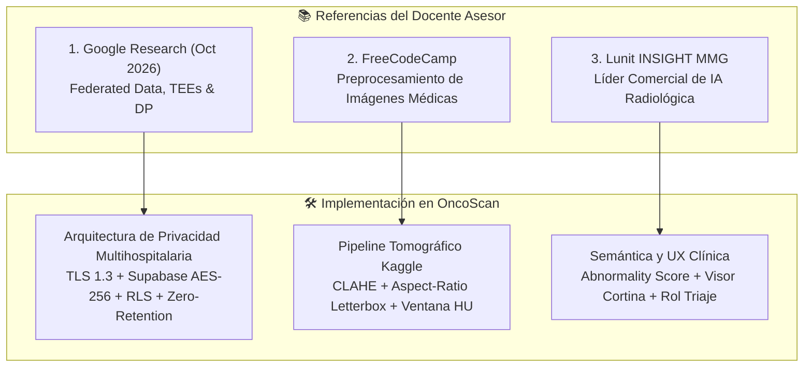
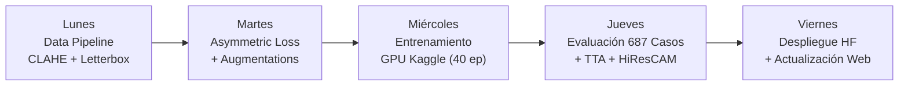

# OncoScan — Plan de Trabajo y Ejecución Técnica (Semana Entrante)
## Mejoras del Modelo v1.2, Nuevas Referencias del Docente y Estrategia de Sustentación Clínica

> **Documento Maestro de Planificación y Referencias**  
> **Fecha de Creación:** Octubre 2026  
> **Proyecto:** OncoScan Platform — Sistema de IA Multimodal para Apoyo a la Detección Temprana de Cáncer de Pulmón  
> **Destinatarios:** Equipo de Desarrollo (Luis & Juan), Docente Asesor y Médica Patóloga Evaluadora  
> **Estado:** Documento congelado para ejecución programada la próxima semana

---

## 1. Resumen Ejecutivo y Metas de la Semana

El presente documento consolida **todas las directrices, enlaces de investigación y requerimientos** recibidos del docente asesor, así como la preparación para la sustentación ante la especialista en patología y el plan de entrenamiento técnico para evolucionar el modelo desde la versión **`multimodal-v1.1`** (activa en producción) hacia la versión **`multimodal-v1.2`**.

### 1.1 Metas Clave de Rendimiento para la Versión 1.2
| Métrica | Estado Actual (`v1.1`) | Meta Planificada (`v1.2`) | Justificación Médica |
| :--- | :---: | :---: | :--- |
| **Falsos Negativos (FN)** | **25 casos** (de 296 enfermos) | **< 15 casos** | Un falso negativo en cáncer pulmonar representa un paciente que pierde la ventana de tratamiento curativo temprano. |
| **Sensibilidad (Recall)** | **91.6%** | **$\ge$ 95.0%** | Exigencia clínica internacional para herramientas de tamizaje tomográfico (ACR Lung-RADS). |
| **AUC-ROC** | **0.950** | **$\ge$ 0.955** | Alta capacidad de discriminación entre tejido benigno/normal y nódulos sospechosos. |
| **Exactitud Global** | **89.8%** | **$\ge$ 90.0%** | Rendimiento global balanceado en cohorte independiente de 687 casos. |
| **Resolución de Entrada** | $64 \times 64$ px | **$128 \times 128$ px** (o $224 \times 224$ px) | Aumenta el mapa de características convolucionales de $2\times 2$ a $4\times 4$ / $7\times 7$, mejorando la nitidez de Grad-CAM. |
| **Fidelidad Grad-CAM** | JET estándar ($0.4 L3 + 0.6 L4$) | **HiResCAM + CLAHE** | Elimina artefactos en bordes y enfoca la activación en la morfología real del nódulo. |

---

## 2. Compilado de Referencias del Docente y su Aplicación en OncoScan

El docente asesor compartió tres fuentes fundamentales para robustecer el proyecto antes de entrenar la nueva versión. A continuación se detalla qué enseña cada una y cómo se integrará exactamente en OncoScan:

---

### Referencia 1: Google Research (2 de Octubre, 2026)
* **Artículo:** *"Toward provably private learning from federated data"* (Google Research & University of Waterloo).
* **Concepto Clave:** Demuestra cómo entrenar modelos de aprendizaje profundo a partir de fuentes distribuidas y sensibles sin centralizar los datos originales, garantizando privacidad mediante la combinación de **Federated Learning (FL)**, **Trusted Execution Environments (TEEs)** y **Privacidad Diferencial (DP)**.
* **Aplicación Concreta en OncoScan:**
  1. **Privacidad Actual (Fase 1 - Desplegada):**
     * **Anonimización DICOM:** Purgado estricto de PHI (`PatientName`, `PatientID`, `InstitutionName`) antes de guardar en almacenamiento persistente; solo se retienen metadatos de calibración física (`RescaleIntercept`, `RescaleSlope`, `WindowCenter`, `WindowWidth`).
     * **Cifrado Integral:** TLS 1.3 en tránsito (HTTPS) y AES-256 en reposo (Supabase Storage).
     * **Aislamiento por Médico:** Políticas de *Row-Level Security* (RLS) en PostgreSQL impiden que un centro de salud o médico acceda a estudios de otro.
     * **Modo Cero-Retención (Zero-Retention Mode):** Para centros de alta sensibilidad, la imagen se procesa exclusivamente en la memoria RAM del microservicio de Hugging Face y se destruye inmediatamente tras generar el score y Grad-CAM.
  2. **Hoja de Ruta Multicéntrica (Fase 2 - Evolutiva):**
     * Para futuros reentrenamientos colaborativos entre instituciones (ej. Hospital Universitario del Valle, Clínica Imbanaco y Fundación Valle del Lili), OncoScan adoptará agregación federada dentro de enclaves seguros (TEEs), garantizando que **ninguna tomografía pulmonar abandone los servidores locales del hospital**.

---

### Referencia 2: FreeCodeCamp — Preprocesamiento de Imágenes Médicas
* **Guía:** *"How to Preprocess Medical Images for Machine Learning"* (FreeCodeCamp).
* **Concepto Clave:** Detalla los 6 pilares indispensables para preparar imágenes radiológicas antes de alimentarlas a una red neuronal convolucional (CNN), evitando distorsiones que destruyan las características anatómicas.
* **Los 6 Pilares Adaptados al Pipeline de OncoScan:**

1. **Ventaneo en Unidades Hounsfield (HU Scaling):**
   * El tomógrafo captura valores de atenuación entre $-1000\text{ HU}$ (aire) y $+3000\text{ HU}$ (hueso compacto o implantes metálicos). El parénquima pulmonar y los nódulos residen en el rango de $-600\text{ HU}$ con un ancho de ventana de $1500\text{ HU}$.
   * **Implementación:** Calibrar la matriz de entrada en la ventana pulmonar estándar $[-1350, +150]\text{ HU}$ o $[-1000, +400]\text{ HU}$, recortando atenuaciones externas antes de escalar a $[0, 1]$.
2. **Normalización Estandarizada (Z-score):**
   * Ajustar cada corte a media cero y desviación unitaria: $\hat{X} = \frac{X - \mu}{\sigma + \epsilon}$, mitigando diferencias de calibración entre marcas de tomógrafos (GE, Siemens, Toshiba, Philips).
3. **Mejora de Contraste Adaptativo Local (CLAHE):**
   * *Contrast Limited Adaptive Histogram Equalization*. Vital para nódulos en vidrio deslustrado (GGO) y nódulos subsólidos que tienen densidades muy cercanas al tejido aéreo circundante. CLAHE amplifica el contraste local de los márgenes y las espiculaciones sin saturar el ruido de fondo.
4. **Validación y Auditoría DICOM:**
   * Verificación automática de la orientación axial estándar, integridad de las etiquetas de rescale de Hounsfield y descarte de cortes corruptos o con grosor de corte excesivo ($> 5.0\text{ mm}$).
5. **Redimensionamiento con Preservación de Relación de Aspecto (Letterbox / Padding):**
   * **Problema detectado en pipelines genéricos:** Forzar una imagen no cuadrada a $128\times 128$ o $224\times 224$ mediante interpolación bilineal distorsiona la morfología del nódulo (un nódulo benigno circular se estira en un óvalo que simula espiculación maligna).
   * **Solución v1.2:** Escalar manteniendo el *aspect ratio* y rellenar los bordes (*letterboxing*) con el valor mínimo de atenuación del aire ($-1000\text{ HU}$).
6. **Supresión de Ruido y Artefactos:**
   * Filtrado suave de artefactos de haz (*beam hardening*) y ruido cuántico en tomografías de baja dosis (LDCT).

---

### Referencia 3: Lunit INSIGHT MMG / Challenge
* **Referente:** Lunit Inc. (Software de IA radiológica para mamografía y tórax con certificaciones FDA y CE). Enlaces: [Lunit INSIGHT MMG](https://www.lunit.io/en/ai-radiology-software/insight-mmg/) y [Insight Challenge](https://insight-challenge.csg-krc.lunit.io/).
* **Lecciones de Producto, Regulación e Interfaz para OncoScan:**
  1. **Semántica de "Abnormality Score":**
     * Lunit no entrega un veredicto absolutista ("cáncer sí" / "cáncer no"), sino un **Score de Anormalidad (0% a 100%)** que cuantifica la probabilidad de que una lesión requiera acción médica o biopsia.
     * En OncoScan utilizaremos formalmente el término **Score de Sospecha / Anormalidad (0.00 – 1.00)** categorizado en rangos clínicos (Bajo: $< 0.30$, Indeterminado: $0.30 - 0.60$, Alto: $> 0.60$).
  2. **Rol de Asistente de Triaje ("Second Reader"):**
     * Lunit posiciona su IA como un "segundo lector concurrente" que prioriza la lista de trabajo del radiólogo para que los casos sospechosos se atiendan de primeros, reduciendo los falsos negativos hasta en un 50% y acortando los tiempos de lectura.
     * Este enfoque valida exactamente la propuesta de valor de OncoScan para el sistema de salud colombiano.
  3. **Visor Interactivo en Cortina (Before / After Slider):**
     * La interfaz insignia de Lunit permite al radiólogo deslizar una cortina vertical entre la imagen nativa limpia y la imagen con el mapa de calor/contornos.
     * En OncoScan ya contamos con este componente (`BeforeAfterViewer.tsx`); la versión v1.2 lo potenciará integrando el mapa térmico de HiResCAM de alta resolución.
  4. **Procesamiento Efímero en Memoria:**
     * Lunit garantiza en sus acuerdos comerciales que las imágenes clínicas de los clientes no se utilizan para reentrenar modelos sin consentimiento expreso y se procesan de forma transitoria en la memoria RAM del servidor de inferencia. OncoScan replica esta arquitectura con Hugging Face Spaces.

---

## 3. Dossier de Sustentación ante la Médica Patóloga

Cuando la especialista en patología examine el proyecto, el debate no girará en torno a hiperparámetros de redes neuronales, sino a la **validez biológica, el origen de las etiquetas y el estándar de oro**.

### 3.1 Anatomía y Composición del Dataset LIDC-IDRI
* **Volumen General:** 1,010 pacientes únicos con tomografías helicoidales de tórax.
* **La Verdad Histológica (Crucial para la Patóloga):**
  * De los 1,010 pacientes, **sólo 157 cuentan con confirmación histopatológica en TCIA**:
    * **~98 pacientes con neoplasia maligna confirmada por biopsia/resección:** Predominio de Carcinoma No Microcítico (Adenocarcinoma con patrones acinar/papilar/lepídico y Carcinoma Escamocelular).
    * **~59 pacientes con diagnóstico benigno confirmado:** Granulomas tuberculosos o micóticos inactivos, hamartomas y nódulos con estabilidad volumétrica mayor a 2 años.
  * **Los restantes ~850 pacientes:** La etiqueta no proviene de patología quirúrgica, sino del **consenso independiente de 4 radiólogos torácicos certificados**.

### 3.2 El Filtro de Consenso Riguroso de OncoScan
Para no entrenar la IA con casos dudosos o ruidosos:
* **Clase Positiva (Nódulo - 1):** Cortes donde **los 4 radiólogos (100% de acuerdo unánime)** delimitaron la lesión.
* **Clase Negativa (Normal - 0):** Cortes de parénquima donde al menos **3 de los 4 radiólogos** confirmaron ausencia de anomalías.
* **Cortes con desacuerdo (1/4 o 2/4):** Fueron excluidos del entrenamiento para proteger la pureza del gradiente.
* **Evaluación Independiente:** Conjunto de prueba congelado de **687 casos** (296 positivos y 391 sanos).

### 3.3 Correlación Histopatológica de los 8 Parámetros de Entrada
| Parámetro Clínico | Escala | Correlato Tisular e Histopatológico en el Microscopio |
| :--- | :---: | :--- |
| **Espiculación (`spiculation`)** | 1–5 | **Signo cardinal de malignidad.** Refleja **desmoplasia estromal** (reacción fibroblástica densa del huésped) e infiltración celular tumoral que progresa a lo largo de los septos interlobulillares y vías linfáticas peribroncovasculares (*corona radiata*). |
| **Calcificación (`calcification`)** | 1–6 | Patrones en "palomitas de maíz", concéntricos o centrales corresponden a patología benigna inactiva (hamartomas o granulomas antiguos). En carcinomas invasivos activos la calcificación suele ser **nula (valor 6)** o manifestarse como microcalcificaciones distróficas amorfas. |
| **Lobulación (`lobulation`)** | 1–5 | Bordes lobulados traducen tasas heterogéneas de proliferación celular entre diferentes subclones tumorales, o zonas donde el tumor encuentra resistencia mecánica contra pleura o cartílago bronquial. |
| **Textura (`texture`)** | 1–5 | Nódulos en vidrio deslustrado puro (GGO) correlacionan típicamente con adenocarcinoma *in situ* o hiperplasia adenomatosa atípica (crecimiento lepídico sobre paredes alveolares preservadas). El desarrollo de un núcleo sólido central marca invasión del estroma fibroso. |
| **Margen (`margin`)** | 1–5 | Márgenes mal definidos u oscilantes denotan un frente infiltrativo tumoral agresivo invadiendo los espacios aéreos contiguos. |
| **Esfericidad (`sphericity`)** | 1–5 | Las lesiones perfectamente esféricas suelen corresponder a granulomas benignos o metástasis hematógenas secundarias. El carcinoma broncogénico primario típicamente prolifera de forma irregular y asimétrica. |
| **Sutileza (`subtlety`)** | 1–5 | Contraste de atenuación entre el nódulo y el aire pulmonar circundante. |
| **Sospecha (`malignancy`)** | 1–5 | Juicio radiológico global estructurado. |

### 3.4 Guion Magistral para Sustentar ante la Patóloga
> *"Doctora, tenemos absoluta claridad en que **en oncología el único estándar de oro de certeza diagnóstica es la biopsia histopatológica y la tipificación celular en el microscopio**. OncoScan no pretende en ningún momento sustituir al patólogo ni emitir un diagnóstico citológico.*
>
> *OncoScan se diseñó como una herramienta de **triaje y priorización temprana en tomografía computarizada**. Su objetivo es identificar a los pacientes con nódulos de alta sospecha biológica (por ejemplo, aquellos que exhiben desmoplasia estromal reflejada en espiculaciones radiológicas y ausencia de calcificaciones benignas), para que sean **remitidos oportunamente a neumología intervencionista y a su servicio de patología**, evitando que un cáncer pulmonar en estadio temprano progrese silenciosamente mientras espera semanas por una cita."*

---

## 4. Plan de Acción Técnico Día a Día (Semana Entrante)

Este es el cronograma de trabajo paso a paso para ejecutar la próxima semana en el notebook de Kaggle y el microservicio:

### Lunes: Data Pipeline & Preprocesamiento en Kaggle
1. **Resolución Espacial:** Configurar el tamaño de imagen de entrada a **$128 \times 128$ px** (o $224 \times 224$ px según memoria VRAM de la GPU T4).
2. **Aspect-Ratio Preserving Resize (Letterbox):**
   * Crear la función de transformación que escala la dimensión mayor a 128/224 px y aplica relleno (*padding*) simétrico con valor $-1000\text{ HU}$ (aire), evitando distorsionar nódulos esféricos.
3. **Integración de CLAHE:**
   * Aplicar `cv2.createCLAHE(clipLimit=2.0, tileGridSize=(8,8))` sobre la ventana pulmonar normalizada para realzar bordes espiculados y nódulos subsólidos.
4. **Verificación de Split por Paciente (Zero-Leakage):**
   * Confirmar mediante `sklearn.model_selection.GroupKFold` que todos los cortes de un mismo `patient_id` queden estrictamente en el mismo subconjunto (Train, Val o Test), garantizando que no haya fuga entre particiones.

### Martes: Asymmetric Focal Loss & Data Augmentation
1. **Implementación de `AsymmetricFocalLoss` en PyTorch:**
   * Penalizar con factor $\alpha=0.75$ la omisión de nódulos positivos y amortiguar el gradiente de ejemplos fáciles negativos ($\gamma=2.0$):
   $$\mathcal{L}_{\text{asym}}(p_t) = -\alpha_t (1 - p_t)^\gamma \log(p_t)$$
2. **Pipeline de Data Augmentation con `albumentations`:**
   * Rotaciones leves ($\pm 15^\circ$).
   * *HorizontalFlip* ($p=0.5$).
   * *RandomBrightnessContrast* sutil para simular variaciones de dosis de radiación.
   * *ShiftScaleRotate* con preservación de escala.
3. **Prueba Unitaria de Gradientes:**
   * Ejecutar un mini-batch sintético para validar que la función de pérdida converge y no produce NaNs.

### Miércoles: Entrenamiento en Kaggle (GPU T4)
1. **Configuración de Hiperparámetros:**
   * Épocas: 40.
   * Batch size: 32 (o 64).
   * Optimizador: `AdamW(lr=1e-4, weight_decay=1e-2)`.
   * Scheduler: `CosineAnnealingLR(optimizer, T_max=40, eta_min=1e-6)`.
   * Early Stopping: Paciencia de 6 épocas monitorizando **Validation Recall** (priorizando la reducción de Falsos Negativos).
2. **Guardado de Checkpoints:**
   * Serializar `best_model_multimodal_v1.2.pth` junto con el archivo de configuración `config_v1.2.json` (incluyendo medias y desviaciones de las 8 variables clínicas).

### Jueves: Evaluación Rigurosa, TTA & HiResCAM
1. **Evaluación Formal sobre los 687 Casos de Prueba Congelados:**
   * Generar predicciones probabilísticas para los 391 casos sanos y los 296 casos patológicos.
2. **Test-Time Augmentation (TTA):**
   * Evaluar cada tomografía en 4 variantes (original, flip horizontal, rotación $+90^\circ$, rotación $-90^\circ$). Promediar probabilidades para estabilizar la predicción.
3. **Migración a HiResCAM:**
   * Implementar la formulación de HiResCAM (multiplicación elemento a elemento de activaciones y gradientes) para erradicar las manchas térmicas en las esquinas de la imagen.
4. **Construcción de Métricas Consolidadas:**
   * Calcular la nueva Matriz de Confusión oficial.
   * Verificar cumplimiento: **FN $\le 15$**, **Sensibilidad $\ge 95\%$**, **AUC $\ge 0.950$**.

### Viernes: Despliegue en Hugging Face Spaces & Frontend
1. **Actualización del Microservicio de Inferencia:**
   * Clonar repositorio `luisdam-oncoscan-ai` en Hugging Face Spaces.
   * Reemplazar archivo de pesos con `best_model_multimodal_v1.2.pth`.
   * Actualizar `app.py` con el pipeline de preprocesamiento (CLAHE + Letterbox + TTA + HiResCAM).
   * Probar endpoint `POST /predict` con casos de prueba conocidos y verificar respuesta 200 OK en $< 1.5$ segundos.
2. **Sincronización en Aplicación Web (`apps/web`):**
   * Actualizar `apps/web/src/components/modelo/modelData.ts` con las métricas finales de `v1.2`.
   * Actualizar la matriz de confusión y curvas ROC en `/platform/modelo` y la landing page.
   * Realizar prueba integral desde el navegador: Subida de tomografía $\rightarrow$ Backend Render $\rightarrow$ HF Spaces $\rightarrow$ Visor con HiResCAM.

---

## 5. Tabla de Archivos Involucrados la Próxima Semana

| Ruta del Archivo | Lenguaje / Tipo | Acción Requerida la Próxima Semana |
| :--- | :---: | :--- |
| `notebooks/train_multimodal_v1.2.ipynb` | Jupyter / Python | Notebook en Kaggle con resolución $128\times 128$, CLAHE, Letterbox, Asymmetric Focal Loss y entrenamiento GPU. |
| `kaggle_evaluation_script.py` | Python | Script de validación en batch de los 687 casos del test set para generar métricas oficiales. |
| `hf_space/app.py` | Python / FastAPI | Microservicio en Hugging Face Spaces con soporte para pesos v1.2, TTA y HiResCAM. |
| `apps/web/src/components/modelo/modelData.ts` | TypeScript | Archivo fuente de verdad de métricas, matriz de confusión y curvas para la plataforma web. |
| `docs/evaluacion-v1.1-plan-v1.2.md` | Markdown | Registrar el cierre de la versión 1.1 y archivar formalmente los resultados alcanzados por la versión 1.2. |

---

## 6. Lista de Chequeo de Cierre (Audit Checklist)

Antes de dar por concluida la actualización la próxima semana, se deberán verificar los siguientes puntos de control:
* [ ] ¿El modelo v1.2 redujo los Falsos Negativos a menos de 15 casos?
* [ ] ¿La Sensibilidad clínica alcanzó o superó el 95.0%?
* [ ] ¿El preprocesamiento preserva la relación de aspecto mediante Letterbox sin estirar nódulos?
* [ ] ¿El mapa térmico HiResCAM está centrado exactamente sobre la región de interés y no en el fondo?
* [ ] ¿El endpoint en Hugging Face responde en menos de 2 segundos en CPU?
* [ ] ¿Las métricas mostradas en la plataforma web coinciden exactamente con la evaluación empírica de los 687 casos?
* [ ] ¿El guion para la médica patóloga está memorizado y claro para el equipo?
