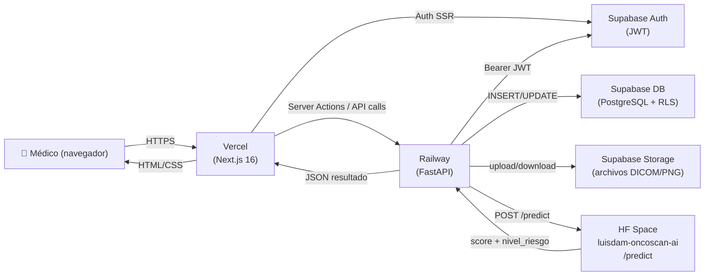

# OncoScan — Documento Común (todos los roles)

> **Audiencia:** los 5 integrantes del equipo. Leer antes de la defensa.
> Este documento es el punto de partida; los docs de rol enlazan aquí.

---

## Qué es OncoScan

OncoScan es una plataforma académica de apoyo a la detección temprana de cáncer pulmonar. Permite a médicos subir imágenes DICOM (tomografías de tórax), ingresar características radiológicas del nódulo y obtener un score de riesgo oncológico generado por un modelo de IA entrenado con el dataset LIDC-IDRI.

> **Disclaimer:** OncoScan es una herramienta académica de apoyo diagnóstico. **No es un dispositivo médico certificado** y su resultado no reemplaza el juicio del especialista.

---

## Stack completo

| Capa           | Tecnología                                        |
|----------------|---------------------------------------------------|
| Frontend       | Next.js 16 + React 19 + Tailwind 4               |
| Backend        | FastAPI 0.115 + Python 3.11 + httpx               |
| Base de datos  | Supabase (PostgreSQL + Storage)                   |
| Auth           | Supabase Auth + middleware Next.js                |
| Modelo IA      | HF Space `luisdam-oncoscan-ai` — endpoint `/predict` |
| Deploy front   | Vercel (root `apps/web`)                          |
| Deploy back    | Railway (proyecto `ideal-strength`, root `apps/api`) |

---

## Mapa del monorepo

```
Benditos_cancer_detector/
├── apps/
│   ├── web/          # Next.js — UI, rutas, server actions
│   │   ├── src/app/  # App Router: pages, layouts, loading, error
│   │   └── src/components/ui/  # Componentes UI reutilizables
│   └── api/          # FastAPI — proxy IA, validación DICOM, rutas auth
│       ├── app/api/v1/routers/  # health, dicom, analysis
│       ├── app/core/            # config, logging PHI, security JWT
│       └── app/services/        # hf_client.py (proxy HF Space)
├── supabase/migrations/  # 3 migraciones SQL (aplicar manual)
└── docs/             # Documentación técnica y PSP
    └── presentacion/ # ← esta carpeta
```

---

## Diagrama de arquitectura



---

## Cómo importar de git

```bash
git clone <URL-del-repo>
cd Benditos_cancer_detector

# Ver ramas activas
git branch -a

# Convención de commits (en español)
# tipo: descripción breve
# Tipos: feat, fix, chore, docs, refactor, style, test
git commit -m "feat: agregar validación de modality en upload"
```

---

## Cómo correr TODO localmente (end-to-end)

> Ver también: [docs/setup-nuevo-pc.md](../setup-nuevo-pc.md) para la guía completa de instalación de dependencias.

### 1. Variables de entorno

**Backend** — copiar y editar `apps/api/.env`:
```
SUPABASE_URL=https://tu-proyecto.supabase.co
SUPABASE_SERVICE_ROLE_KEY=<service_role_key>
SUPABASE_BUCKET_NAME=dicom-uploads
HF_API_BASE_URL=https://luisdam-oncoscan-ai.hf.space
HF_PREDICT_TIMEOUT=120
HF_MODEL_VERSION=luisdam-oncoscan-ai@v1
```

**Frontend** — copiar `apps/web/.env.example` como `apps/web/.env.local` y editar:
```
NEXT_PUBLIC_SUPABASE_URL=https://tu-proyecto.supabase.co
NEXT_PUBLIC_SUPABASE_PUBLISHABLE_KEY=sb_publishable_...
NEXT_PUBLIC_API_URL=http://localhost:8000
API_URL=http://localhost:8000
```

### 2. Levantar el backend

```bash
cd apps/api
python -m venv venv
# Windows:  venv\Scripts\activate
# Mac/Linux: source venv/bin/activate
pip install -r requirements.txt
uvicorn app.main:app --reload --port 8000
```

Verificar: `http://localhost:8000/api/v1/health` → `{"status":"ok"}`

### 3. Levantar el frontend

```bash
cd apps/web
npm install
npm run dev
```

Abrir: `http://localhost:3000`

---

## Cómo funciona el frontend (alto nivel)

- **App Router de Next.js**: cada carpeta en `src/app/` es una ruta. Las páginas son Server Components por defecto.
- **Auth gate**: `apps/web/src/app/platform/layout.tsx` verifica la sesión con Supabase SSR y redirige a `/login` o `/cuenta-pendiente` si el médico no está aprobado.
- **Flujo de upload**: el usuario llega a `/platform/upload`, sube el archivo, ingresa las 8 features clínicas y solicita el análisis IA. Todo desde la misma página.
- **Server Actions**: los formularios usan server actions (no `useState` para data flow), salvo las páginas con estado interactivo complejo (como `/platform/upload`).
- **Componentes UI**: ver `apps/web/src/components/ui/` — Button, Card, AlertBanner, RiskBadge, etc.
- **Tokens de color**: `brand-primary #012641` (azul) para acciones; `brand-danger #EE005A` (rojo) **solo** para alertas clínicas.

---

## Cómo funciona el backend (alto nivel)

```
Request HTTP
    │
    ▼
FastAPI router (app/api/v1/routers/)
    │   health.py  → GET /health (sin auth)
    │   dicom.py   → POST /dicom/upload, POST /dicom/analyze/{id}
    │   analysis.py → POST /analysis/predict, GET /analysis/{id}
    │
    ▼
app/core/security.py → verifica Bearer JWT con Supabase
    │
    ▼
app/services/hf_client.py → llama HF Space /predict
    │
    ▼
app/db/supabase_client.py → INSERT/UPDATE dicom_uploads
```

- **Config**: `app/core/config.py` carga env vars; lanza `RuntimeError` si faltan variables críticas.
- **Logging PHI**: `app/core/logging.py` define `log_event()` que rechaza claves con PHI y `hash_id()` para enmascarar IDs.

---

## Patrones de diseño transversales

| Patrón | Dónde |
|--------|-------|
| **Capa de servicios** | `apps/api/app/services/` — lógica desacoplada de los routers |
| **Inyección de dependencias** | FastAPI `Depends(get_current_user)` en todos los endpoints protegidos |
| **Server Actions** | Next.js — formularios sin API extra para operaciones server-side |
| **Design Tokens** | `apps/web/src/app/globals.css` — colores semánticos via CSS custom properties |
| **RLS (Row Level Security)** | Supabase — médico solo ve sus propios datos; admin ve todo mediante `is_admin()` |
| **Manejo de PHI** | `PHI_KEYS` en `log_event()` rechaza datos sensibles en logs; signed URLs server-side |

---

## Flujo end-to-end de un caso

```
1. Médico sube archivo DICOM en /platform/upload
        │
        ▼
2. POST /api/v1/dicom/upload
   → Valida DICOM (tags, Modality=CT)
   → Sube a Supabase Storage
   → Crea fila en dicom_uploads (status: "uploaded")
        │
        ▼
3. Médico ingresa features clínicas (8 parámetros radiológicos)
        │
        ▼
4. POST /api/v1/dicom/analyze/{dicom_id}
   → Descarga archivo de Storage
   → Convierte DICOM → PNG
   → POST al HF Space /predict (sincrónico, timeout 120s)
   → Recibe { score, nivel_riesgo, recomendacion, modelo_version }
   → UPDATE dicom_uploads (status: "analyzed", ai_score, ai_risk_level, ...)
        │
        ▼
5. Frontend muestra score, nivel de riesgo (ALTO/MEDIO/BAJO) y recomendación
   → Colores: ALTO = brand-danger (rojo), MEDIO = amber, BAJO = emerald
```

---

## Documentos de rol (leer el tuyo)

- [01 — PM + DevOps (Mateo)](01-pm-devops-mateo.md)
- [02 — IA + QA](02-ia-qa.md)
- [03 — Base de Datos](03-database.md)
- [04 — Frontend](04-frontend.md)
- [05 — Backend](05-backend.md)
- [06 — Guion de presentación](06-guion-presentacion.md)

## Anexos técnicos

- [Esquema de BD](esquema-bd.md)
- [Catálogo de API](api-reference.md)
